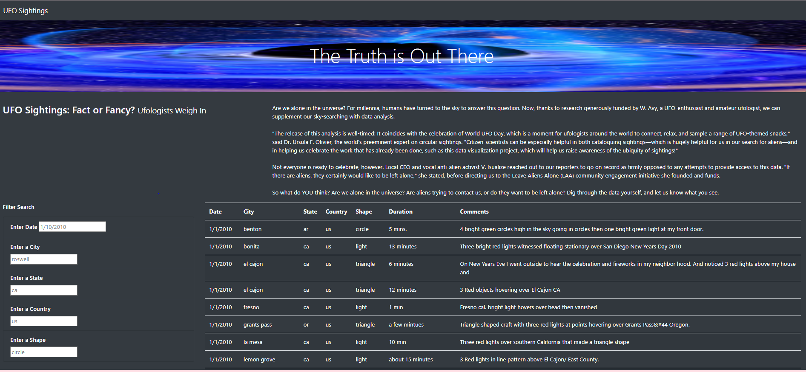

# UFOs
## Overview
this analysis is to use JavaScript, and HTML to search UFO sightings based on the criteria that users enter. UFO sightings data is provided by the model.

## HTML Page and Results
UFO sighting searching results include dates, places, and UFO details. Users can filter the sightings by inputting the followings:
-- Date: follow the date format provided in the input box
-- City: type a full city name
-- State: input two digits state code
-- Country: input two digits country code
-- UFO Shape: input the shape name

## Summary
### Drawback
The inputs on this HTML are case sensitive and do not provide a partial text filter for City, State, Country, and UFO shape inputs.

### Future Improvements
-- Date filter can be changed from a text input to a selection from a calendar list.
-- Country, State, City can be a joined filter. Example: Country could be selected from a listed country. After a country is selected; then, states could be a dropdown list that only contains the status for the countries selected.
-- UFO shape should be a static dropdown list that allows users to know how many shapes of UFO are available to choose.
